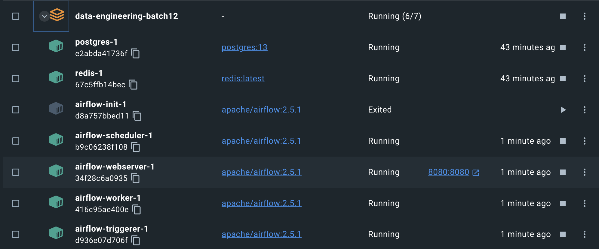
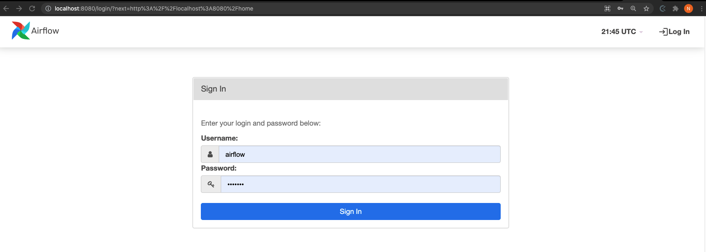
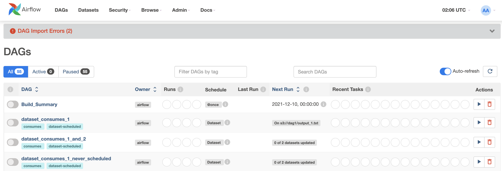

## Local Development
### One-Time Setup
#### Docker 설치
먼저 Docker를 설치하는 방법을 알아보자

1. [Docker Community Edition (CE)](https://docs.docker.com/engine/installation/)을 본인의 컴퓨터에 설치한다. 보통 최소 4GB의 메모리를 할당해야 도커가 정상적으로 동작하기에 사양이 낮은 컴퓨터라면 도커를 사용하지 않는 것이 낫다. 윈도우를 사용 중이라면 [Docker for Windows](https://docs.docker.com/docker-for-windows/#resources>)에서 Resources 섹션을 참고하고 맥을 사용 중이라면 [Docker for Mac](https://docs.docker.com/docker-for-mac/#resources)에서 Resources 섹션을 참고하기 바란다
2. 제대로 설치가 되었는지 확인하기 위해 `docker compose version` 명령을 실행한다. 최소 버전 1.29.1이나 그 이상의 버전이 필요하다.
```
 % docker compose version
Docker Compose version v2.15.1
```

#### Docker Settings
1. 최소 4GB (이상적으로는 8GB)의 메모리를 Docker에 할당한다. 이는 Settings -> Resources -> ADVANCED 메뉴에서 설정 가능하다

#### Install `pipenv`
The Docker image we use relies on `pipenv` to create a virtual environment with appropriate packages downloaded.

Run
```
$ pip3 install pipenv
```

Though the image itself has command to download `pipenv` to be used in the container, you want to make sure you can generate a `Pipfile.lock` file, since the container will ignore the `Pipfile` and use the `Pipfile.lock` to install packages.

For more information on `pipenv`, please refer to this [page](https://pipenv-fork.readthedocs.io/en/latest/basics.html).

### Spinning Up Local Airflow Services
1. data-engineering-batch13 리포를 다운로드받고 메인폴더로 이동한다. 여기 있는 dags 폴더가 결국 airflow dags 폴더가 되고 여기 있는 파이썬 파일들이 DAG로 인식된다.
```
git clone https://github.com/keeyong/data-engineering-batch13.git
cd data-engineering-batch13
```
2. Airflow 2.5.1에 해당하는 docker-compose.yaml을 다운로드받는다.
```
curl -LfO 'https://airflow.apache.org/docs/apache-airflow/2.5.1/docker-compose.yaml'
```
3. `docker compose up airflow-init`를 실행한다. 이 때 Redis와 Postgres가 실행되고 Airflow 설치가 완료된다.

4. Airflow를 실행하기 위해 `docker compose up` 명령을 실행한다.
5. `docker ps` 명령을 실행해서 모든 프로세스가 동작하는지 확인한다.
```
CONTAINER ID   IMAGE                  COMMAND                  CREATED          STATUS                   PORTS                    NAMES
416c95ae400e   apache/airflow:2.5.1   "/usr/bin/dumb-init …"   11 minutes ago   Up 3 minutes (healthy)   8080/tcp                 data-engineering-batch13-airflow-worker-1
b9c06238f108   apache/airflow:2.5.1   "/usr/bin/dumb-init …"   11 minutes ago   Up 3 minutes (healthy)   8080/tcp                 data-engineering-batch13-airflow-scheduler-1
d936e07d706f   apache/airflow:2.5.1   "/usr/bin/dumb-init …"   11 minutes ago   Up 3 minutes (healthy)   8080/tcp                 data-engineering-batch13-airflow-triggerer-1
34f28c6a0935   apache/airflow:2.5.1   "/usr/bin/dumb-init …"   11 minutes ago   Up 3 minutes (healthy)   0.0.0.0:8080->8080/tcp   data-engineering-batch13-airflow-webserver-1
e2abda41736f   postgres:13            "docker-entrypoint.s…"   53 minutes ago   Up 3 minutes (healthy)   5432/tcp                 data-engineering-batch13-postgres-1
67c5ffb14bec   redis:latest           "docker-entrypoint.s…"   53 minutes ago   Up 3 minutes (healthy)   6379/tcp                 data-engineering-batch13-redis-1
```
도커 프로그램에서 위의 프로세스들이 실행되고 있는지 다시 한번 확인한다

5. 브라우저를 열고 `http://localhost:8080/`로 접근한다. 다음과 같은 로그인 페이지가 보여야 한다:

6. 아래 정보로 로그인한다
    * username: `airflow`
    * password: `airflow`

7. 로그인하면 아래와 같은 페이지가 보여야 한다


### Airflow 컨테이너로 로그인하는 방법
1. `docker ps`를 실행하고 data-engineering-batch13-airflow-scheduler-1의 CONTAINER ID를 추출한다. 아래 예라면 b9c06238f108에 해당한다. 
```
CONTAINER ID   IMAGE                  COMMAND                  CREATED          STATUS                   PORTS                    NAMES
416c95ae400e   apache/airflow:2.5.1   "/usr/bin/dumb-init …"   11 minutes ago   Up 3 minutes (healthy)   8080/tcp                 data-engineering-batch13-airflow-worker-1
b9c06238f108   apache/airflow:2.5.1   "/usr/bin/dumb-init …"   11 minutes ago   Up 3 minutes (healthy)   8080/tcp                 data-engineering-batch13-airflow-scheduler-1
...
```
2. Container ID("b9c06238f108")를 바탕으로 `docker exec -it b9c06238f108 sh`를 실행한다. 그러면 셀 모드로 들어갈 수 있고 거기서 airflow 명령어를 실행할 수 있다. 소스 코드 편집은 앞서 코드리포를 다운로드 받은 폴더(data-engineering-batch13) 밑의 dags 폴더를 사용하면 된다.
```
% docker exec -it b9c06238f108 sh
(airflow)airflow tasks list HelloWorld
/home/airflow/.local/lib/python3.7/site-packages/airflow/models/base.py:49 MovedIn20Warning: [31mDeprecated API features detected! These feature(s) are not compatible with SQLAlchemy 2.0. [32mTo prevent incompatible upgrades prior to updating applications, ensure requirements files are pinned to "sqlalchemy<2.0". [36mSet environment variable SQLALCHEMY_WARN_20=1 to show all deprecation warnings.  Set environment variable SQLALCHEMY_SILENCE_UBER_WARNING=1 to silence this message.[0m (Background on SQLAlchemy 2.0 at: https://sqlalche.me/e/b8d9)
print_goodbye
print_hello
```
3. Root로 로그인하고 싶다면 `docker exec -u 0 -it b9c06238f108 sh`를 실행한다.

예를 들어 "No module named 'MySQLdb'"에러가 난다면 root로 로그인해서 아래 명령들을 실행한다
```
sudo apt-get update
sudo apt-get install default-libmysqlclient-dev build-essential
```

다음으로 airflow 유저로 로그인해서 다음 명령을 실행한다
```
pip install mysqlclient
```
